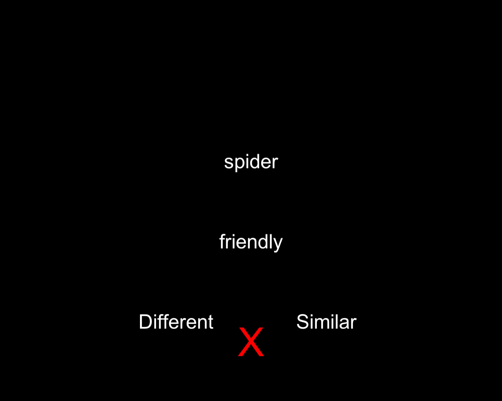
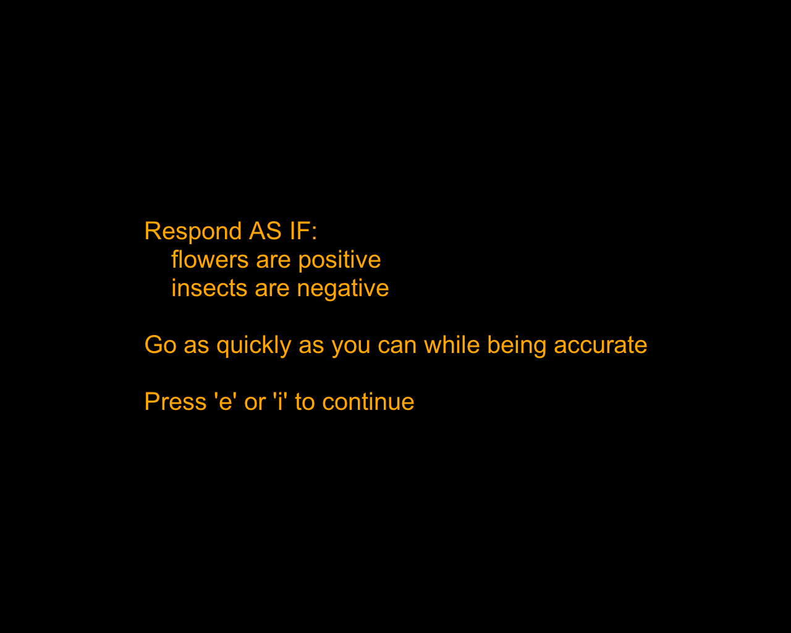

# Open Source IRAP

Implicit Relational Assessment Procedure

[TOC]

## License
Copyright (c) Ian Hussey 2015 (ian.hussey@ugent.be)

Released under the GPLv3+ open source license. 

This program is free software: you can redistribute it and/or modify it under the terms of the GNU General Public License as published by the Free Software Foundation, either version 3 of the License, or any later version.

This program is distributed in the hope that it will be useful, but WITHOUT ANY WARRANTY; without even the implied warranty of MERCHANTABILITY or FITNESS FOR A PARTICULAR PURPOSE. See the GNU General Public License for more details.
## Version
0.9.9.1

*NB This code is still in beta - it hasn't been used it in a published article yet.*

## Description & purpose
The Implicit Relational Assessment Procedure (IRAP: [Barnes-Holmes et al., 2010](http://opensiuc.lib.siu.edu/tpr/vol60/iss3/10/)) was designed by Relational Frame Theory researchers to capture the relative strength of relational responding, but it has frequently been used as a measure of implicit attitudes more generally. See [Vahey et al., 2015](http://www.sciencedirect.com/science/article/pii/S0005791615000051) for a meta analysis of clinically relevant IRAP studies.
This implementation is designed for use by experimental and experimental-clincial psychologists. 

This implementation of the IRAP has very high fidelity to the procedure described in Barnes-Holmes et al. (2010: a sketch of the IRAP and REC model), and to other implementations of the IRAP (e.g., the IRAP "2010" and variants, written in Visual Basic 6). Most task parameters are soft coded and can be changed via the `task.xlsx` file (see task parameters section below).

- Each trial presents a "label" stimulus at the top of the screen, a "target" stimulus in the middle of the screen, and two response option labels at the bottom left and right of the screen. 
- There are two label stimuli categories and two target stimuli categories, which when combined create four "trial types".
- Incorrect responses result in a red X being presented on screen. Progression to the next trial is contingent on a correct response.

- Inter trial interval is set to 400 ms.
- Participants complete pairs of blocks of trials in which the response contingencies alternate (e.g., flowers-positive-similar vs. flowers-positive-different).
- Each block is preceded by a customisable responding rule (Rule A and Rule B, e.g., "Respond AS IF flowers are positive and insects are negative").

- Each block is also followed by feedback about the median latency and % accuracy in the block.

- Participant complete practice block pairs (e.g., max 4) until they meet mastery criteria on both blocks in a pair (e.g., median latency <= 2000ms and accuracy >= 80%), and then a fixed number of test block pairs (e.g., 3). If mastery criteria are not bet within the max the task skips the test blocks and goes to the end screen.
- Typically, reaction time differences between the two block then are quantified (e.g., using the *D*1 effect size score, below) in order to produce a measure of "implicit attitudes" (although see [De Houwer, 2006](http://users.ugent.be/~jdhouwer/why.pdf)).

## Requirements
- [PsychoPy - v1.82](https://github.com/psychopy/psychopy/releases/tag/r1.82.02)
  - A free and open source program for delivering psychology experiments written in Python. See [here for documentation](http://www.psychopy.org/documentation.html).
  - PsychoPy runs locally on Windows, Mac, and Linux. It's not possible to run PsychoPy scripts online.
  - You might be able to use more recent versions, but will probably need to run the `Open Source IRAP.py` file rather than the `Open Source IRAP.psyexp` file.

- [R - v3.3.1](https://www.r-project.org/) or later
  - The included data processing script is written in R. I reccomend you run it in [RStudio](https://www.rstudio.com/), a very user friendly interface for R.

## Usage
### 1. Running
You can run either the `Open Source IRAP.psyexp` file or the `Open Source IRAP.py` file inside PsychoPy. The `Open Source IRAP.py` file should have greater cross platform support; if you run into errors with the `Open Source IRAP.psyexp` file use `Open Source IRAP.py` instead.

- If you're using a newer version of PsychoPy, the `Open Source IRAP.psyexp` will not run. Use the `Open Source IRAP.py` instead.
- The left response is the "e" key, and the right response is the "i" key. 
- The return key ends the task properly once you reach the end of "task screen". 
- The escape key quits the task at any time.

If you run the `Open Source IRAP.psyexp` file, a `Open Source IRAP_lastrun.py` will be created. This can be ignored. 

If you run the `Open Source IRAP.py` file, a `Open Source IRAP.pyc` file will be created. This can also be ignored.

### 2. Delivery
In order to minimise attrition rates (e.g., <c.10%), the majority of published IRAP work has been delivered one-to-one by a trained researcher. Additionally, many published studies have employed some form of standardised experimenter script. See the `experimenter script` folder. 

### 3. Localisation and customisation
All stimuli and instructions within the task are set via the `stimuli.xlsx` and `task.xlsx` files.

PsychoPy has Unicode support, so translating the task into other languages (Spanish, Polish, Japanese, etc.) only requires changes to these excel files.

- NB a poorly documented bug is that if you zip and unzip excel files using archive utility on Mac OS X, Unicode characters are no longer correctly displayed and will throw an ASCII error in PsychoPy. Make new excel files to correct the issue.

### 4. Stimuli
Label and target stimuli can be either text or image stimuli. The default `stimulus.xslx` file employs text stimuli for both labels and targets. The alternative file in the `alternative stimuli files>picture and word stimuli` folder file employs images as labels and text stimuli as targets. Simply move these file to the same folder as the `Open Source IRAP.psyexp`/`Open Source IRAP.py` to run. Although, you can mix and match as you like; you can even make some rows text stimuli and some rows image stimuli.

The file that will be used is that which is placed in the same folder as the `Open Source IRAP.psyexp`/`Open Source IRAP.py` that is run. All image stimuli should be placed in the same folder. Remember to reduce your image files to as small as possible so as to minimise load and rendering time. 

If using text stimuli, put `blank.png` in the image columns (e.g., `labelB_image_stimuli`) and the text stimuli in text stimuli column (e.g., `labelB_stimuli`). The task presents images on every trial either way; this sets it to present a black square that is effectively invisible. As such, the `blank.png` file must always be left in the same folder as the `Open Source IRAP.psyexp`/`Open Source IRAP.py` files.

If using image stimuli, put a single space character (i.e., ` `) in the text stimuli column and the name of the image file (including extension) in the image stimuli column. Failure to do either this or the above step will cause PsychoPy to throw an error message.

You can employ an arbitrary number of stimulus exemplars per category, but all columns in the excel stimulus file must have the same number of rows (i.e., exemplars). The number of trials per block is a function of the number of exemplars (see task parameters below).

The response options (i.e., "similar" and "different") are specified in the `task.xlsx` file.

- NB response option "A" will be presented on the *right* hand side in the first block (assuming block order = "a" and moving response options = False). Here, I have followed practices from the IAT literature to map the most probable response (e.g., similar is "default" over different, true over false, etc) to the right hand, which is more likely to be the dominant hand. This may differ in other implimentations of the task. 

The pre block rules are also specified in the `task.xlsx` file. These can be generic for both blocks (e.g., "learn to respond correctly based on the feedback") or specific to each and the stimulus set (e.g., "respond AS IF flowers are positive and insects are negative").

- NB insert return characters/line breaks inside excel files using alt-⏎ (Windows) / ⌃⌥⏎ (Mac). This can be useful for instructions.

### 5. Task parameters
The number of trials per block is equal to (the number of rows in the `stimuli.xlsx` file) \* (4 [the number of trial types]). 

- For example, IRAPs frequently employ four exemplars per stimulus category, and 32 trials per block. The default stimulus file accomplishes this by including the four exemplars twice each (on separate rows) in the `stimuli.xlsx` file. 8 rows(4 exemplars \*2 rows each)\*4(trial types) = 32 trials per block.

Each block contains an equal number of each trial type. This is determined by the `block_layout.xlsx` file, which specifies how label and target stimuli are combined to make trial types. This file should not be altered.

The `task.xlsx` file also specifies:

- `stimulus_file`, a variable for specifying where the task should look for its stimuli. The default is `stimuli.xlsx`.
- practice block mastery accuracy criterion
  - This is specified out of 100% (e.g., 80), not 1 (e.g., .8)
- practice block median latency criteria 
  - This is specified in *seconds*, not milliseconds.
- maximum number of practice block pairs
- number of test block pairs
- location of the response options (left vs. right)
  - Response options locations can be either fixed or moving randomly. Default is "False" (fixed), set this to "True" for moving.
- the screen location of all stimuli
  - All screen locations are specified in PsychoPy's [normalised units](http://www.psychopy.org/general/units.html#normalised-units).

The values provided in the included file are representative of commonly used task parameter values among published studies. E.g.:

- accuracy \>= 80% correct
- median latency <= 2.0 seconds
- Max 4 practice block pairs
- 3 test block pairs
- fixed location of response options

One key parameter that is not set in the `task.xlsx` file is the order of presentation of the blocks (i.e., block order). Instead, this is set for each participant in the dialogue box that appears after you run the task. This was implimented this was as it's the only variable that sometimes differs between participants within a study. The default is "a" (rule A first). Set this to "b" for rule B first. I.e., if you wish to counterbalance block order, the researcher must set the block order for each participant using the dialogue box when the participant number is entered.

### 6. Sequential IRAPs
Many study designs specify that participants complete multiple IRAPs in a row. The current implimentation can deliver multiple tasks inside one instance of the script being run. That is, the researcher only hits the run button once, and only one data file is produced, but the participant completes two (or more) IRAPs in sequence. The instructions can easily be altered to instruct the participant to take a rest or contact the experimenter between IRAPs. 

To do this, simply include additional rows in the `task.xlsx` file which specify the parameters of the next IRAP. It's likely that the rules will differ, as will the `stimulus_file` that is to be drawn from for that IRAP. Working examples can be found in the `alternative stimulus files>multiple IRAPs in a row` folder. Simply move these file to the same folder as the `Open Source IRAP.psyexp`/`Open Source IRAP.py` to run.

The order of delivery of the IRAPs follows the sequence of the rows in the `task.xlsx` file. To make this random rather than sequential, change appropriate variable in `Open Source IRAP.psyexp` (i.e., task loop, loopType = random).

### 7. Auto-response "monkey" for piloting the task
When you run the task, an auto-response 'monkey' can be invoked by setting "UseMonkey" in the dialogue box to "y" or "yes". This will simulate key presses throughout the task to that you can test your script without you having to hit E and I interminably. The monkey simply simulates the I key and then the E key, in that order, on every trial. As such, the simulated accuracy should be c.50%. For the task to run through fully including test blocks, you must to lower the accuracy criterion to below 50% (e.g., just put it to 0).

## Output
### 1. Data files
`.psydat`, `.csv` and `.log` files are produced for each participant. The `.csv` file alone is sufficient to most analyses (e.g., calculation of D scores). To my understanding, the format of the `.csv` output files are Tidy Data compliant (Wickham, 2014) and therefore easy to analyse (e.g., in R) with little to no processing needed.

### 2. Data processing
The included `data processing.r` R script produces accuracy and latency summary data and *D*1 scores for each participant (including "overall" *D*1 scores, *D*1 scores for each trial-type, and split-half overall *D*1 scores).

Very little familiarity with R/RStudio is needed to use this script. 

1. Change the set working directory line to the location of your data
   - i.e., the line containing[the line containing `setwd()`
   - e.g. `setwd("~/git/Open Source IRAP/data`
   - NB you must have at least one output file that has test block data for the script to run. 
2. Change the save output line to your chosen directory 
   - i.e., the line containing `write.csv()`
   - e.g., `write.csv(all_tasks_df, file = '~/git/Open Source IRAP/data processing/processed_IRAP_data.csv', row.names=FALSE)`)
3. Run the script (e.g., in RStudio on mac: ⌘-a to select all lines and ⌘-⏎ to run; windows: ctrl-a to select all lines and ctrl-⏎ to run).

The script produces a `processed_IRAP_data.csv` file with the following variables for analysis:
​	
	unique_identifier  # participant+stimulus_file+date
	stimulus_file	
	participant	gender	
	age	
	date	
	starting_block  # a or b	
	max_pairs_practice_blocks	
	n_pairs_test_blocks	
	latency_criterion  # in seconds, not ms	
	accuracy_criterion  # out of 100%, not 1.0 (e.g., 80)	
	moving_response_options  # TRUE or FALSE	
	auto_response_monkey  # TRUE or FALSE	
	rule_A	
	rule_B	
	response_option_A	
	response_option_B	
	labelA_text_stimuli_exemplars  # list of unicode exemplars	
	labelB_text_stimuli_exemplars	
	targetA_text_stimuli_exemplars	
	targetB_text_stimuli_exemplars	
	labelA_image_stimuli_exemplars	
	labelB_image_stimuli_exemplars	
	targetA_image_stimuli_exemplars	
	targetB_image_stimuli_exemplars	
	n_pairs_practice_blocks	
	D1	
	D1_trial_type_1	
	D1_trial_type_2	
	D1_trial_type_3	
	D1_trial_type_4	
	D1_odd	
	D1_even	
	rt_mean
	percentage_accuracy	
	exclude_based_on_fast_trials  # TRUE or FALSE	
	passed_practice_blocks  # TRUE or FALSE

Note that while this file includes contains all the necessary info to replicate an IRAP in the absense of having access to the PsychoPy `.psyexp`/`.py file`, `stimuli.xlsx` file and `task.xlsx file`. Only the screen locations and initial instructions are not saved here. This also allows one to easily determine what experiment an output file was produced by, e.g., if it were misplaced.
​	
#### a. *D*1 scoring method
*D* scores are (Greenwald et al., 2003) are a variant of Cohen's *d* effect size, and are used to quantify the effect size difference between two response patterns (e.g., rts on block As vs. block Bs in an IRAP). They differ from Cohen's *d* in how standard deviations are calculated, sub variants differ in their exclusion criteria and the presence/absence of an error penalty. *D*1 scores are have been employed in the majority of published IRAP research to date (although see next heading). The generic steps in calculating *D*1 scores are as follows: 

1. Participants with >10% of (test block) trials <300ms are excluded. 
2. All rts > 10000 ms are excluded.
3. *D*1 = (mean rt block B - mean rt block A) / SD of all trials in blocks A and B.

As noted above, one key step in calculating *D*1 scores is excluding participants who produce >10% rts < 300ms. The current R script outputs the variable `exclude_based_on_fast_trials` which indicates that a participant should be excluded if `TRUE`. These exclusions must be done by the researcher, and are not automatically done by the script. This is in order to allow the auto response monkey functions correctly and quickly, and due to the fact that the majority of IRAP research to date has not explicitly included this step, given that some other implimentations of the task do not output this specific information.

The method employed to calculate *D*1 scores here and in much of the published research to date is as follows: that four *D*1 scores are calculated for each test block pair, one for each trial type. Given that most IRAP studies deliver three pairs of test blocks, 12 *D*1 scores are therefore usually calculated. These are then averaged across the three block pairs to leave four trial-type *D*1 scores. One "overall" *D*1 score is then often calculated by averaging these four trial- type *D*1 scores (see Barnes-Holmes, Barnes-Holmes, Stewart & Boles, 2010). 

#### b. Interpretation
In brief, a positive *D*1 score (overall only, not by trial type) indicates an automatic preferences for resopnding in block A over block B. That is for responding to label A (e.g., flowers) and target A (e.g., positive) faster with response option A (e.g., similar) than with response option B (e.g., different). 

- Positive *D*1 scores can be referred to using the formula:
  - `labelA-targetA/labelB-targetB|responseOptionA/responseOptionB`
  - e.g., a flowers-positive/insects-negative|similar/different effect
- Negative *D*1 scores can be referred to using the formula: 
  - `labelA-targetB/labelB-targetA|responseOptionA/responseOptionB`
  - e.g., a flowers-negative/insects-positive|similar/different effect

NB The columns in which you enter stimuli into the `stimuli.xlsx` and `task.xlsx` files will therefore influence the direction of your effects and how they should be interpreted (e.g., placing the "flowers" stimuli in the labelA or labelB column, or "similar" in the responseOptionA or responseOptionB column). 

See Hussey, Thompson, McEnteggart, Barnes-Holmes & Barnes-Holmes (2015) and Greenwald, Nosek & Banaji (2003) for paper length discussions of the *D*1 score, its interpretation generally, and its application and interpretation within the IRAP. 

NB other scoring algorithms are available, such as the *G* score (adjusted gaussian fractional rank score: Sriram et al., unpublished) and the Probabilistic Index (PI: De Schryver, 2013; Thas, De Neve, Clement & Ottoy, 2012; De Schryver, Hussey, Thas, Cartwright, & Barnes-Holmes, under review) but have not seen much use, despite their apparant conceptual and statistical advantages.

#### c. *D*-IRAP vs *D*1 nomenclature
Many published articles refer to the "*D*-IRAP" score rather than the " *D*1" score, as it was originally referred to by Greenwald et al. (2003). This was on the rationale that there are differences between the two, e.g., when applied to the IRAP scores are often calculated for each trial type rather than one overall score. However, *D*1 refers only to the general strategy of [difference between means/SD of all items, with some exclusion criteria]. Indeed, even when applied to the IAT, "pure" *D*1s are not typically calculated; rather, one is typically calculated for blocks 3&6 and a second for 4&7 and the two are then averaged. As such, to separate the generic effect size scoring method from the specific analytic strategy employed in a given experiment (e.g., overall D scores, trial-type D scores, etc.), this script refers to *D*1 scores throughout. 

#### d. Exclusions of test block data 

While several articles to date have employed the method used by Nicholson & Barnes-Holmes (2012; see Hussey, Thompson, et al., 2015 for disussion), who excluded *D*1 scores from single test block pairs and averages the remaining ones, De Schryver, Hughes, De Houwer & Rosseel (in prep: "On the Interpretation of Reliability in the Context of Implicit Cognition") make a persuasive argument for treating the data produced by a given instance of a measure as a single analytic unit. That is, rather than excluding individual test block pairs where the participant fails to maintain the test block criteria, De Schryver et al argue that exclusions should be done based on overall task performance. As such, the processing script here produces on overall test block accuracy score and one mean test block reaction time score. Test block exclusions can then be applied to these (e.g., outliers defined as absolute deviation from mean rt > 2.5 SD).

#### e. Trial type designations

- Trial type 1 refers to trials that present a label 1 stimulus and a target 1 stimulus.
- Trial type 2 refers to trials that present a label 1 stimulus and a target 2 stimulus.
- Trial type 3 refers to trials that present a label 2 stimulus and a target 1 stimulus.
- Trial type 4 refers to trials that present a label 2 stimulus and a target 2 stimulus.

## Timing accuracy
PsychoPy is technically capable of millosecond timing, depending on design choices by the researcher (see Garaizar & Vadillo, 2014). 

The current implementation is written to be at least as accurate as other implementations of the IRAP (i.e., accurate to within a frame or c.17ms). The stimuli to be presented within a block are generated on the pre-block rule screen, and then `pop()`'d on each trial.

If you're looking for higher accuracy (e.g., for EEG/fMRI work) you'll want to change all timings to frames rather than seconds. You may also want to remove the presentation of images if you're not using them.

- NB no assessment of jitter has been conducted for the current implementation.

## Issues 
If you have any issues, find bugs, or observe any unwanted divergences from other implementations of the IRAP, please report them [using GitHub's issue reporting system](https://github.com/ianhussey/OpenSourceIRAP/issues). Doing it online rather than by emailing me allows other people to benefit from your experience. 

If there are additional features or refinements you would like to see please feel free to contribute to the project yourself by branching, editing, and submitting a pull request on Github. You can also email me at [ian.hussey@ugent.be](mailto:ian.hussey@ugent.be). 

### Known issues
1. If a participant gets 100% of trials correct throughout the task then the incorrect response RT column will not be created for that participant. This is a) extremely unlikely, and b) not a problem if you process data files based on column header matching (e.g., most R methods, including the bundled script). However, it can be problematic if your data processing workflow relies on column order rather than column header name (e.g., a SPSS script using a GET command).

## To do list
1. Update the `Open Source IRAP.psyexp` file to work in PsychoPy v1.84+ once it's released.

## Changelog
### 0.9.9.1

1. processing script updated to calculate D1 scores for each block pair and then average them. This is not necessarially statistically more appropriate than simply binning all con blocks versus all incon blocks, but it is consistent with published IRAP work. 
2. Readme updated appropriately, and images fixed.

### 0.9.9

1. Auto-install dependencies for R script.

### 0.9.8

1. Tidied up the `inst_code` code component so that dependencies and functions run at Begin Experiment and only necessary code runs at Begin routine.
2. Changed `inst_code` from loading stimuli from a hard coded `stimuli.xlsx` to a soft coded `stimulus_file` variable, which was added to `task.xlsx`. This allows the researcher to deliver multiple different sequential IRAPs within the one script while still producing a single output file for each participant.
3. Changed `data processing.r` (now 0.7.2) to add a single filter() line to select only the data from the IRAP of interest. This line is commented out but contains a note on its use. 
4. Added additional example stimuli files to demonstrate how multiple IRAPs may be delivered in sequence. 
5. `data processing.r` (now 0.7.2) also groups data by unique_identifer (a concate of participant, stimulus_file, and date) rather than participant code. This avoids inappropriately treating duplicate participant codes as a single participant. This also allows the script to process multiple IRAPs in the same data file at once. 

### 0.9.7
1. Changes to the stimuli selection and shuffling function. All functions now in the first routine. All stimulus exemplars are now saved to the output file (first row only).
2. R script (v.7) now saves the stimulus exemplars, rules, and response options to the `processed_IRAP_data.csv` file. This file now contains all the necessary info to replicate an IRAP in the absense of having access to the psychopy script, `stimuli.xlsx` file and `task.xlsx file`. Only the screen locations and initial instructions are not saved here. This also allows one to easily determine what experiment an output file was produced by should it have been misplaced. 
3. The R script also quantifies participants who passed the practice block criteria and completed test blocks.

### 0.9.6
1. Made the code that generates and selects the stimuli for each trial in a block more transparent by writing it as a function and calling it rather than repeating code. No functional difference for the user, but better code transparency and consistency across the IAT/RRT/IRAP codebase.
2. Added data processing R script. 

### 0.9.5
1. Added option for block order selection via the dialogue box.
2. Added auto response monkey
3. Added option for image stimuli.
4. Added option for moving response options.
5. Tidied up post block text and locations.
6. Added warning level logging
7. Separated the block layout and stimuli excel files. This allows for an arbitrary number of exemplars for each stimulus category.